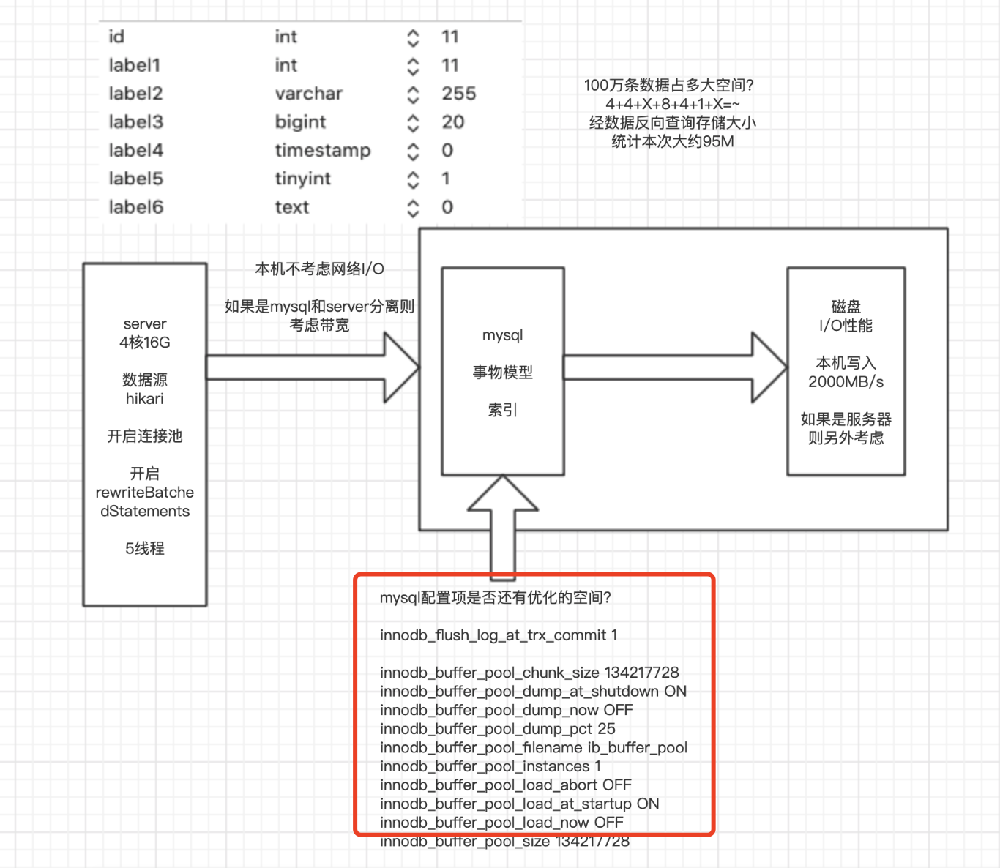

# 学习笔记

1. （必做）按自己设计的表结构，插入 100 万订单模拟数据，测试不同方式的插入效率

   - 作业路径：https://github.com/gugongerguo/JAVA-01/tree/main/Week_07/jdbc
     - test下面两个测试类

   - 作业分析：

     前提：数据源使用Hikari，并配置连接池。

     结论1：

     MySQL的JDBC连接的url中要加rewriteBatchedStatements参数，并保证5.1.13以上版本的驱动，才能实现高性能的批量插入。
     MySQL JDBC驱动在默认情况下会无视executeBatch()语句，把我们期望批量执行的一组sql语句拆散，一条一条地发给MySQL数据库，批量插入实际上是单条插入，直接造成较低的性能。
     只有把rewriteBatchedStatements参数置为true, 驱动才会帮你批量执行SQL
     另外这个选项对INSERT/UPDATE/DELETE都有效

     ```java
     //两字段
     //batch insert 1000条*1000次 运行时间：148532ms-->2m28s
     //batch insert 10000条*100次 运行时间：115859ms-->1m55s
     //batch insert 100000条*10次 运行时间：110460ms-->1m50s
     //加上参数后jdbc:mysql://127.0.0.1:3316/insert_demo?rewriteBatchedStatements=true
     //batch insert 1000条*1000次 运行时间：35963ms-->0m35s
     //batch insert 10000条*100次 运行时间：7679ms-->0m7s
     //batch insert 100000条*10次 运行时间：4699ms-->0m4s
     //batch insert 1000000条*1次 运行时间：4954ms-->0m4s
     ```

     结论2:字段数量和字段数据类型会影响插入速度

     ```java
     //7个表字段，各种数据类型，打开开关rewriteBatchedStatements=true
     //batch insert 1000条*1000次 运行时间：46852ms-->0m46s
     //batch insert 10000条*100次 运行时间：14708ms-->0m14s
     //batch insert 100000条*10次 运行时间：11840ms-->0m11s
     //batch insert 1000000条*1次 运行时间：14201ms-->0m14s
     ```

     结论3:多线程会提升写入效率，线程不宜过多

     ```java
     //4核16G 多线程测试，7个表字段，各种数据类型，打开开关rewriteBatchedStatements=true
     //选取batch insert 100000条/次
     //1线程  运行时间：12171ms-->0m12s
     //2线程  运行时间：7791ms-->0m7s
     //5线程  运行时间：5061ms-->0m5s
     //10线程 运行时间：7014ms-->0m7s
     ```

     一百万的数据占多大空间？

     ```
     TINYINT                        1 字节 
     SMALLINT                       2 个字节 
     MEDIUMINT                      3 个字节 
     INT                            4 个字节 
     INTEGER                        4 个字节 
     BIGINT                         8 个字节 
     FLOAT(X)                       4 如果 X < = 24 或 8 如果 25 < = X < = 53 
     FLOAT                          4 个字节 
     DOUBLE                         8 个字节 
     DOUBLE PRECISION               8 个字节 
     REAL                           8 个字节 
     DECIMAL(M,D)                   M字节(D+2 , 如果M < D) 
     NUMERIC(M,D)                   M字节(D+2 , 如果M < D)
     DATE                           3 个字节 
     DATETIME                       8 个字节 
     TIMESTAMP                      4 个字节 
     TIME                           3 个字节 
     YEAR                           1 字节
     CHAR(M)                        M字节，1 <= M <= 255 
     VARCHAR(M)                     L+1 字节, 在此L <= M和1 <= M <= 255 
     TINYBLOB, TINYTEXT           	 L+1 字节, 在此L< 2 ^ 8 
     BLOB, TEXT                     L+2 字节, 在此L< 2 ^ 16 
     MEDIUMBLOB, MEDIUMTEXT         L+3 字节, 在此L< 2 ^ 24 
     LONGBLOB, LONGTEXT             L+4 字节, 在此L< 2 ^ 32 
     ENUM('value1','value2',...)    1 或 2 个字节, 取决于枚举值的数目(最大值65535） 
     SET('value1','value2',...)     1，2，3，4或8个字节, 取决于集合成员的数量(最多64个成员）
     ```

     

     性能瓶颈抽丝拨茧：

     1. 批量提交/开关
     2. 连接池
     3. 数据源
     4. 多线程
     5. mysql配置
     6. 网络带宽
     7. 磁盘读写能力

     依据场景来决定优化的程度


2. （必做）读写分离-动态切换数据源版本1.0
   - 作业路径：https://github.com/gugongerguo/JAVA-01/tree/main/Week_07/dynamicds
   - 实现一主二从，主写，从读，二从负载均衡。